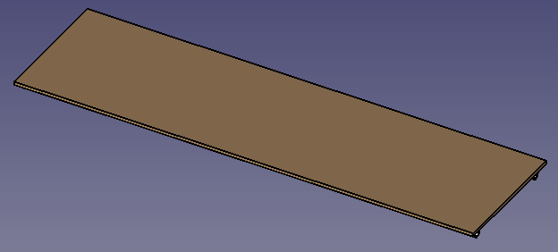
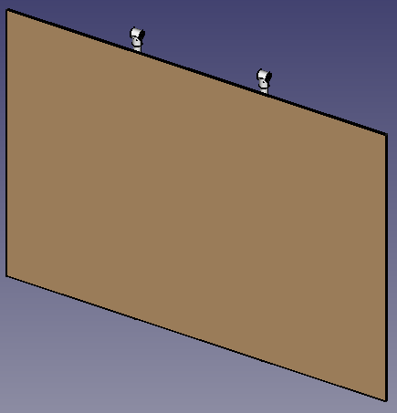

# Composting Toilet Design

This repository contains a set of python files that are used to generate the components and full designs for scaffolding based composting toilets and urinals. This document contains the following sections 

- Design Goals
- Design Costings
- Scaffolding Approach
- Plumbing Approach
- Design Tools
- Appendix: Scaffolding Joint Components

## Design Goals

The design should

- Optimise financial costs for
    - Construction Materials
    - Maintenance
- Optimise volunteer time costs for:
    - Construction
    - Setup
    - Cleaning and Maintenance
    - Strike
- Seperate liquid and solid waste to aid disposal. 
- Ensure that human waste is sealed in order to prevent the spread of gastro intestinal infections.
- Should be able to cope with expected volumes (to be determined) of liquid and solid matter
- TODO More

## Design Costings

A [spreadsheet](https://docs.google.com/spreadsheets/d/10gVWtJp33p0cb3BE8hLPdwHnwx7mQESiJH0xtRfMGkw/edit?usp=sharing) exists outlinging the costs expressed in both finacial costs as well as volunteer time needed for construction setup strike and maintainance of the structures.

## Scaffolding Approach

The primary design approach is to construct scaffolding based interchangeable component structures that are easily connected together to create either:

- Composting Toilet Cabins
- Urinals

The approach is illustrated in this partially constructed model which has a urinal floor on the left hand side and a toilet cabin floor on the right hand side. Each cabin floor section can fit 3 individual cabins.:

    

The components are constructed once and stored whole to enable easy set up and strike. The components are as follows:

- **Side Panel** This is modular panel that is the key to construction. It´s poles are embedded into the ground using holes dug by a power auger. This provides stability, wind resistance and enables the structure to be placed on unlevel ground. It has extensive joints that set the correct distances for all other components. It is symetric so that it can be used as the left, right or center panel of any construction.

    

- **Cabin Ground** This is a simple board with scafolding poles that attach to side panels. It is used to provide a level base for solid waste containers. This is so that the containers fit exactly between the Cabin Ground and the Cabin Floor eliminating access for flies. Along with the Cabin Ground it is the first step in connecting two side panels together to create sit down cabins.

    

- **Cabin Floor** This is a simple panel consisting of a 3 plywood attached to 4 scafolding lengths. The cabin floor also contains wooden guides for fixing cabin partitions. The cabin floor contains fittings for fixing the cabin steps. Along with the Cabin Ground it is the first step in connecting two side panels together to create sit down cabins.

    

- **Urinal Floor** This is a simple panel consisting of a single plywood sheet attached to 4 scafolding lengths. It is the first step in connecting two side panels together to create a urinal.

    

- **Cabin Back** This is a plywood based panel attached to poles and fittings. It is slotted into the fixings at the back of the Cabin Floor then fixed at the top to a pole that is slid through the Panel Sides at roof height. It is also fided to the panel sides. The cabin rear also contains wooden guides for fixing cabin partitions. When constructing urinal it is the third step.

    

- **Urinal Back** This is a plywood based panel attached to poles and fittings. It is slotted into the fixings at the back of the Cabin Floor then fixed at the top to a pole that is slid through the Panel Sides at roof height. It is also fided to the panel sides. When constructing urinals it is the second step.

    

- **Cabin Partition** These are a single pole attached to a plywood sheet and topped by a roof joint. The sheet slides into groves attached to the Cabin Back and then slots into a joint on the cabin floor. Once the roof is added the partition is secured to the froont roof pole. 

    

- **Cabin Door** These are a plywood and scaffolding construction that attached via simple hinges to side panels or cabin partitions.
- **Urinal Front** These are plywood and scafolding constructions that provide privacy to the urinals. They are slotted into the fixings at the front of the Urinal Floor then fixed at the top to a pole that is slid through the Panel Sides at roof height, fixing the front of the roof at the same time. They are also fixed to the panel sides. There are 2 for each urinal block.
- **Roof** This is a plywood based panel attached to poles and fittings. It is fixed back to fixings added when fixing cabin or urinal rears. It is fixed at the front by means of poles slid through side panels. The front fixing is done at the same time as Cabin or Urinal Front. It is the step conducted after fixing the rear components.
- **Cabin Steps** This is a folding plywood and scafoliding construction that unfolds and fixes to the Cabin Floor. They run the entire length of the cabin.
- **Urinal Steps** This is a folding plywood and scafoliding construction that unfolds and fixes to the Urinal Floor. They sit in the center of the urinal cabin between the two urinal fronts.

## Plumbing Approach

The plan is to store solid waste in wheelie bin containers and liquid waste in IBCs.

For the composting cabin the liquid waste is separated at the toilet. This enables:

- Liquid waste to flow into IBCs using gravity (Assuming collection point is above the top of the IBC).
- Simplified solid waste collection. Where changing the solid waste container only involves moving a wheelie bin and no messing around with plumbing.

## Design Tools

The files contained in this repository primarily deal with the design of the
structure. They consist of a set of python files in directory /src/python
scriptswith extension ".py". There two sorts of python files:

- **Macro files** - These are files that are used to generate 3d models in the
open source software [FreeCAD](https://www.freecad.org/). To use FreeCAD to
generate the models use the Freecad menu Macro > Macros to navigate to the
file you wish to use. The FreeCAD version used for this project is 0.21.2.
Currently the following Macro files have been created:

    - XXX_simple.py - Draws a fiting or structure of type XXX.
    - XXX_test.py - Tests all the use of the XXX fitting or structure in the
    - context of other components.

- **Support Files** - These define the key parameters, fittings and structure classes used to build composting toilet models:
 
    - parameters.py - contains key parameters upon which the design is based.
    For example seat_height_from_ground specifies the height in millimeters
    that the toilet seat needs to above the ground.
    - fittings.py - contains classes used to create scaffolding fittings.
    - structures.py contains the class to generate different structures taht are combined to create a composting toilet for eaxmple the modular Side Panel

## Appendix: Scafolding Joint Components

The design uses various types of scafolding fittings to join pipes, panels and sections. 
These are listed below:

- [Double Sided Clip](https://pipedreamfittings.com/product/double-sided-mesh-panel-clip-48mm/). Used to fix plywood sheets of 10mm or less to the centre of scaffolding poles. In particular used to fix boards to Side Panels.
- [Single Sided Clip](https://pipedreamfittings.com/product/single-sided-mesh-panel-clip-48mm/). Used to fix plywood sheets of 10mm or less to the centre of scaffolding poles. In particular used to fix boards to Side Panels.
- [Side Outlet T](https://pipedreamfittings.com/product/side-outlet-tee-42mm-c42/). Used to attach 3 poles in a T shape to an existing pole or used as a normal T where it is necessary to view the location of each of the poles at the top of the T. Used extensively in Side Panel Construction.
- [Four Way Cross](https://pipedreamfittings.com/product/4-way-cross-with-central-tube-48mm-d48/). Used to attach 4 poles in a cross shape to an existing pole. A couple are used in Side Panel construction.
- [Long T](https://pipedreamfittings.com/product/long-tee-48mm-key-clamp-fitting/). Used to attach 3 poles in a T shape.
- [Short T](https://pipedreamfittings.com/product/short-tee-48mm-key-clamp-fitting/). Used to attach 2 poles in a T shape. Three are is used in Side Panel construction.
- [Two Socket Cross](https://pipedreamfittings.com/product/two-socket-cross-48mm-key-clamp-fitting/). Used to attach 2 poles to an existing pole. They are used in Side Panel construction.
- [Double Sided Collar](https://pipedreamfittings.com/product/double-sided-collar-plate-90-48mm-d48-2/). Used to attach plywood panels to scafolding. Can handle boards of greater than 10mm thickness.
- [Double Fixing Pad](https://pipedreamfittings.com/product/double-fixing-pad-48mm-d48/). Used to attach plywood panels to scafolding. Can handle boards of greater than 10mm thickness.
- [Rightangle Crossover](https://pipedreamfittings.com/product/90-crossover-48mm-d48/). Used as slots for rear and front sections.
- [Locking Collar](https://pipedreamfittings.com/product/locking-collar-48mm-d48/). Used with slots for rear and front sections.
- [Galvenised End Cap](https://pipedreamfittings.com/product/galvanised-end-cap-48mm/). Used to cap ends of pipes that slot into the ground.
- [Gate Eye](https://pipedreamfittings.com/product/gate-eye-48mm-d48/). Could possibly be used for cabin doors. Maybe an issue with symetry
- [Gate Hinge](https://pipedreamfittings.com/product/gate-hinge-48mm-d48/). Could possibly be used for cabin doors.

